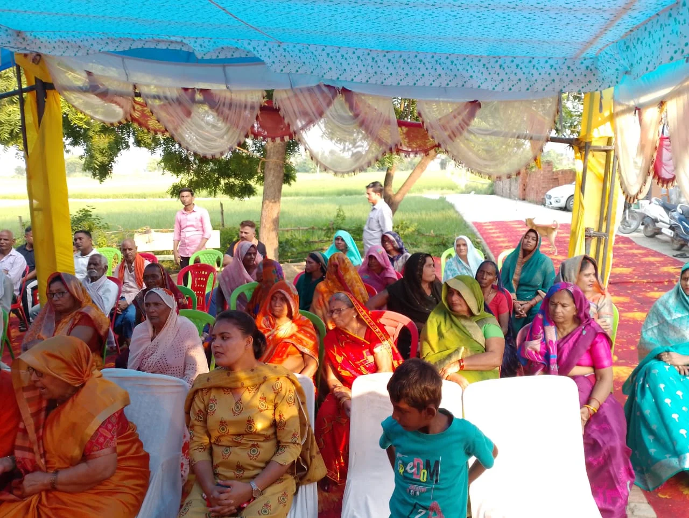

**चंदौली।** चहनिया क्षेत्र के महुआरी खास गांव में आयोजित श्रीमद्भागवत कथा के छठे दिन श्रद्धालु भगवान श्रीकृष्ण की बाल एवं किशोर लीलाओं के भावपूर्ण वर्णन में डूबे रहे। कथा व्यास पंडित राधारमणाचार्य ने कालिया नाग के मान-मर्दन, गोवर्धन लीला और भगवान श्रीकृष्ण-रुक्मिणी विवाह प्रसंग का विस्तार से वर्णन किया। कथा के दौरान पूरा पंडाल भक्तिमय वातावरण से सराबोर रहा।

कथा व्यास ने कालिया नाग प्रसंग का वर्णन करते हुए बताया कि यमुना नदी में कालिया नाग के विष के कारण आसपास का वातावरण दूषित हो गया था। भगवान श्रीकृष्ण ने यमुना में प्रवेश कर कालिया नाग का मान-मर्दन किया और उसके अहंकार को समाप्त करते हुए उसे वहां से चले जाने का आदेश दिया। इस प्रसंग के माध्यम से भगवान की करुणा तथा अधर्म पर धर्म की विजय का संदेश दिया गया।

इसके बाद गोवर्धन लीला का वर्णन किया गया। कथा व्यास ने बताया कि इंद्र के अहंकार के कारण जब ब्रज में भारी वर्षा होने लगी, तब भगवान श्रीकृष्ण ने गोवर्धन पर्वत को अपनी छोटी उंगली पर धारण कर ब्रजवासियों की रक्षा की। इस लीला के माध्यम से भगवान ने इंद्र के अहंकार का भी अंत किया और उन्हें अपनी महिमा का बोध कराया।

**कृष्ण-रुक्मिणी विवाह प्रसंग से भक्तिमय हुआ माहौल**

कथा के अंतिम चरण में जैसे ही भगवान श्रीकृष्ण और रुक्मिणी विवाह का प्रसंग आया, कथा पंडाल में भक्ति की लहर दौड़ गई। रुक्मिणी द्वारा भगवान श्रीकृष्ण को पति रूप में स्वीकार करने और भगवान श्रीकृष्ण द्वारा रुक्मिणी का हरण कर उनसे विवाह करने के प्रसंग को कथा व्यास ने बेहद भावपूर्ण और रोचक ढंग से प्रस्तुत किया।

विवाह प्रसंग के दौरान श्रद्धालुओं ने भजनों का आनंद लिया और भगवान श्रीकृष्ण व रुक्मिणी के जयकारों से पूरा पंडाल गूंज उठा। बड़ी संख्या में मौजूद श्रद्धालु देर तक भक्ति रस में डूबे रहे।
कथा में मोहन सिंह, दीपक सिंह, अंजनी सिंह, विजय सिंह, प्रीति सिंह, सुषमा सिंह, बेचन सिंह, राहुल सिंह और प्रमोद सिंह समेत बड़ी संख्या में श्रद्धालु मौजूद रहे और उन्होंने कथा का श्रवण किया।
