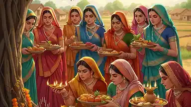

**Jivitputrika Vrat 2026:** हिंदू धर्म में जीवित्पुत्रिका या जितिया व्रत को संतान की लंबी आयु, अच्छे स्वास्थ्य और सुख-समृद्धि की कामना से जुड़ा महत्वपूर्ण व्रत माना जाता है। विशेष रूप से बिहार, झारखंड और उत्तर प्रदेश के कई क्षेत्रों में महिलाएं इस व्रत को श्रद्धा और नियमपूर्वक रखती हैं। मान्यता के अनुसार, माताएं अपनी संतान की कुशलता और दीर्घायु के लिए यह कठिन व्रत करती हैं।

जिवित्पुत्रिका व्रत की शुरुआत नहाय-खाय से होती है और धार्मिक परंपराओं के अनुसार यह प्रक्रिया तीन दिनों तक चलती है। व्रत के दौरान पूजा-अर्चना के साथ जितिया व्रत कथा सुनने या पढ़ने की भी परंपरा है।

**जिवित्पुत्रिका व्रत 2026 की मुख्य तिथियां**

**• नहाय-खाय:** शुक्रवार, 2 अक्टूबर 2026

**• निर्जला उपवास (मुख्य व्रत):** शनिवार, 3 अक्टूबर 2026

**• पारण (व्रत खोलना):** रविवार, 4 अक्टूबर 2026 (सुबह सूर्योदय के बाद, लगभग 6:15 बजे के बाद)

**जिवित्पुत्रिका व्रत के नियम और महत्व**

**• निर्जला उपवास:** यह व्रत बिना जल ग्रहण किए (निर्जला) करीब 24 से 36 घंटे तक रखा जाता है।

**• पूजा विधि:** इस दिन प्रदोष काल में भगवान जीमूतवाहन (जो भगवान विष्णु का ही रूप माने जाते हैं) की पूजा की जाती है। मिट्टी या गोबर से चील और सियारिन की आकृति बनाई जाती है और कथा सुनी जाती है।

**• पारण:** अगले दिन सूर्योदय के बाद स्नान करके और भगवान को अर्घ्य देकर व्रत का पारण किया जाता है।

स्थानीय पंचांग और स्थान के अनुसार मुहूर्त में थोड़ा अंतर हो सकता है।

**जिवित्पुत्रिका व्रत में क्या करना चाहिए?**

व्रत की शुरुआत नहाय-खाय से होती है। इस दिन व्रती महिलाएं प्रातःकाल स्नान करके सात्विक भोजन ग्रहण करती हैं। कई क्षेत्रों में इस दिन मरुवा की रोटी और नोनी साग खाने की परंपरा भी प्रचलित है।

इसके बाद अष्टमी तिथि पर महिलाएं परंपरा के अनुसार निर्जला व्रत रखती हैं। शाम के समय विधि-विधान से पूजा-अर्चना की जाती है और जिवित्पुत्रिका व्रत की कथा सुनी या पढ़ी जाती है।

व्रत पूरा होने के बाद पारण किया जाता है। धार्मिक मान्यताओं के अनुसार इस अवसर पर जरूरतमंद लोगों को अपनी क्षमता के अनुसार भोजन, वस्त्र या अन्य सामग्री का दान करना शुभ माना जाता है।

**जिवित्पुत्रिका व्रत में क्या नहीं करना चाहिए?**

जिवित्पुत्रिका व्रत को कठिन व्रत माना जाता है। परंपरागत रूप से व्रती महिलाएं व्रत के दौरान जल और भोजन ग्रहण नहीं करतीं। हालांकि, स्वास्थ्य संबंधी समस्या होने पर कठोर निर्जला उपवास करने से पहले चिकित्सकीय सलाह लेना उचित है।

व्रत के दौरान तामसिक भोजन से बचने, क्रोध और विवाद से दूर रहने तथा मन को शांत रखने की परंपरा है। साथ ही किसी भी जीव-जंतु को नुकसान न पहुंचाने और संयमित व्यवहार करने की सलाह दी जाती है।

**जितिया व्रत का धार्मिक महत्व**

जितिया व्रत को मातृत्व, संतान की सुरक्षा और परिवार की खुशहाली से जुड़ी धार्मिक परंपरा के रूप में देखा जाता है। अलग-अलग क्षेत्रों में इसके नियम, पूजा विधि और खान-पान की परंपराओं में अंतर भी देखने को मिलता है।

**डिस्क्लेमर:** व्रत एवं पूजा की विधि स्थानीय परंपरा और परिवार की मान्यताओं के अनुसार अलग हो सकती है। सही तिथि और मुहूर्त के लिए अपने क्षेत्र के पंचांग या योग्य ज्योतिषाचार्य से पुष्टि करें।
