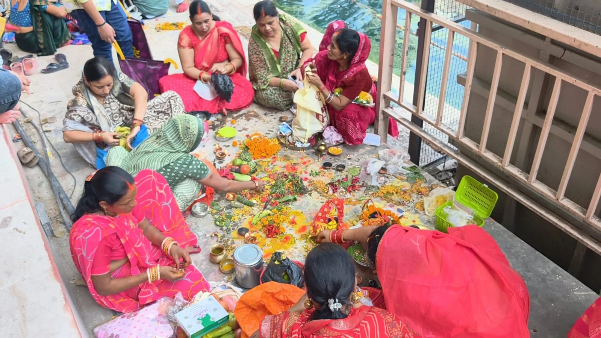
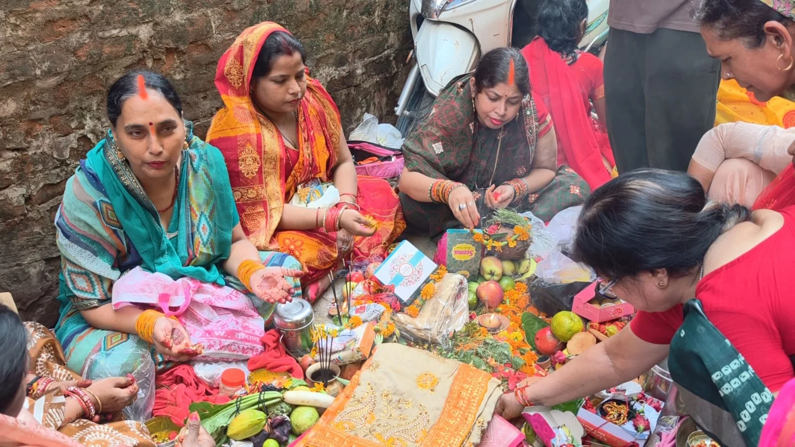

**वाराणसी।** काशी की धरती पर शनिवार को आस्था, विश्वास और लोक परंपरा का अद्भुत संगम देखने को मिला। लक्ष्मीकुंड में 16 दिवसीय जिउतिया व्रत के समापन पर सुबह से ही महिलाओं की भारी भीड़ उमड़ पड़ी। संतान की लंबी उम्र, अच्छे स्वास्थ्य और सुख-समृद्धि की कामना लेकर महिलाओं ने पूरे दिन निर्जला व्रत रखा और विधि-विधान से जिउतिया माता की पूजा-अर्चना की।

सुबह होते ही लक्ष्मीकुंड परिसर में श्रद्धालु महिलाओं के पहुंचने का सिलसिला शुरू हो गया। हाथों में पूजा की थाली, माथे पर सिंदूर और सोलह श्रृंगार में सजी महिलाएं अलग ही आस्था का रंग बिखेरती नजर आईं। परिसर में जगह-जगह बनाए गए मंडपों में महिलाओं ने सामूहिक रूप से पूजा की और जिउतिया व्रत की कथा सुनी।

पूजन के दौरान महिलाओं ने जिउतिया माता को विभिन्न पूजन सामग्री अर्पित कर अपनी संतान की रक्षा और दीर्घायु की कामना की। कथा के बीच गूंजते माता के जयकारों से पूरा लक्ष्मीकुंड परिसर भक्तिमय हो उठा। निर्जला व्रत की कठिन साधना के बावजूद व्रती महिलाओं के चेहरे पर श्रद्धा और उत्साह साफ दिखाई दिया।

**आस्था के रंग में रंगा लक्ष्मीकुंड**

सुबह से लेकर शाम तक लक्ष्मीकुंड और आसपास का क्षेत्र महिलाओं की भीड़ से गुलजार रहा। दूर-दराज के इलाकों से भी महिलाएं परिवार के साथ यहां पहुंचीं। मंडपों में पूजा, कथा और धार्मिक अनुष्ठानों का सिलसिला चलता रहा। गलियों और आसपास के बाजारों में भी विशेष चहल-पहल देखने को मिली।

हर तरफ सजे पूजा मंडप, सोलह श्रृंगार में महिलाएं और जिउतिया माता के जयकारों ने पूरे माहौल को भक्तिमय बना दिया। ऐसा लगा मानो लक्ष्मीकुंड में आस्था और काशी की लोक संस्कृति एक साथ जीवंत हो उठी हो।

**पीढ़ियों से चली आ रही परंपरा**

काशी में जिउतिया व्रत की परंपरा बेहद पुरानी है। लक्ष्मीकुंड का यह आयोजन काशी की लोक आस्था और पारंपरिक संस्कृति से गहराई से जुड़ा हुआ है। इसे काशी के प्रसिद्ध लक्खा मेले की परंपरा में भी गिना जाता है।

आधुनिक दौर में भी महिलाएं इस परंपरा को उसी श्रद्धा और विश्वास के साथ निभा रही हैं। 16 दिवसीय जिउतिया व्रत के समापन पर लक्ष्मीकुंड में जहां संतान की लंबी उम्र के लिए माताओं की तपस्या दिखाई दी, वहीं काशी की समृद्ध लोक परंपरा और संस्कृति की भी मनमोहक झलक देखने को मिली।

जिउतिया माता के जयकारों से गूंजता लक्ष्मीकुंड शनिवार को सिर्फ एक धार्मिक स्थल नहीं, बल्कि मातृत्व की आस्था, विश्वास और काशी की जीवंत परंपरा का खूबसूरत केंद्र बन गया।

**संवाददाता - पवन जायसवाल**
