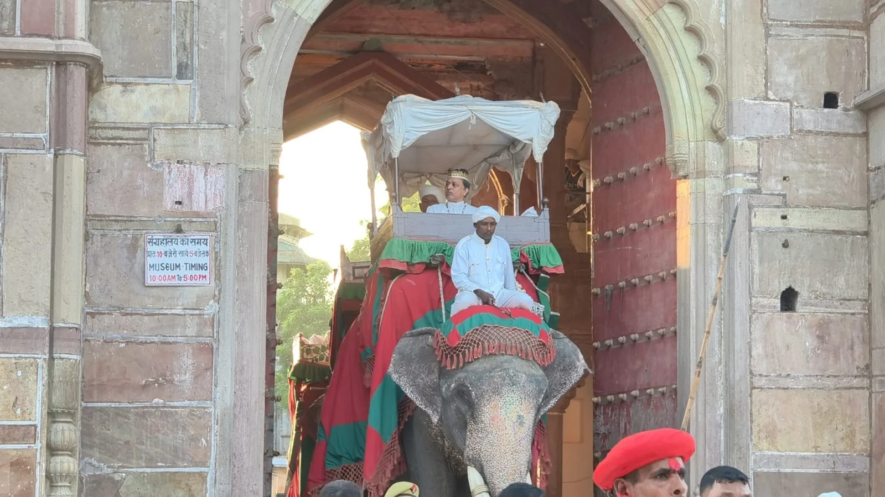

**वाराणसी।** रामनगर की विश्व प्रसिद्ध और ऐतिहासिक रामलीला में शनिवार को श्रीराम के 14 वर्ष के वनवास का भावुक प्रसंग मंचित किया गया। भगवान श्रीराम ने पिता के वचन और रघुकुल की मर्यादा को निभाते हुए वन जाने का निर्णय लिया तो रामलीला स्थल पर मौजूद श्रद्धालु भावुक हो उठे।

श्रीराम के वन गमन का प्रसंग देखने के लिए रामनगर में श्रद्धालुओं की भारी भीड़ उमड़ी। सामान्य दिनों की तुलना में रामलीला देखने वालों की संख्या अधिक रही। बड़ी संख्या में श्रद्धालु परिवार के साथ रामलीला स्थल पहुंचे और प्रभु श्रीराम के वनवास प्रसंग के साक्षी बने।

राम के वन जाने का दृश्य सामने आते ही रामलीला स्थल का माहौल भावनात्मक हो गया। श्रद्धालु जय श्रीराम के जयकारे लगाते नजर आए। कई श्रद्धालुओं ने कहा कि रामनगर की रामलीला की सबसे बड़ी विशेषता इसकी पारंपरिक प्रस्तुति है, जो दर्शकों को रामकथा के प्रसंगों से सीधे जोड़ देती है।

रामनगर की ऐतिहासिक रामलीला में श्रीराम के वनवास का प्रसंग हर वर्ष श्रद्धालुओं के बीच विशेष भावनात्मक माहौल पैदा करता है। इस बार भी राम के वन गमन का मंचन देखने के लिए बड़ी संख्या में लोग पहुंचे और देर तक रामलीला का आनंद लेते रहे।

**संवाददाता — पवन जायसवाल**
