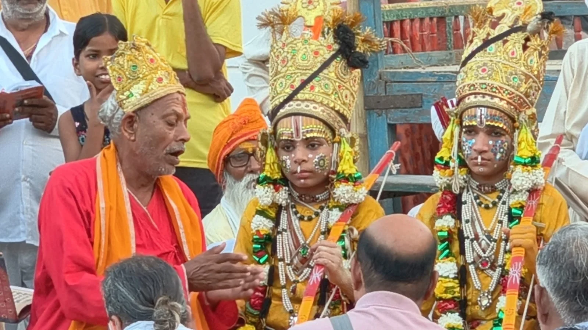
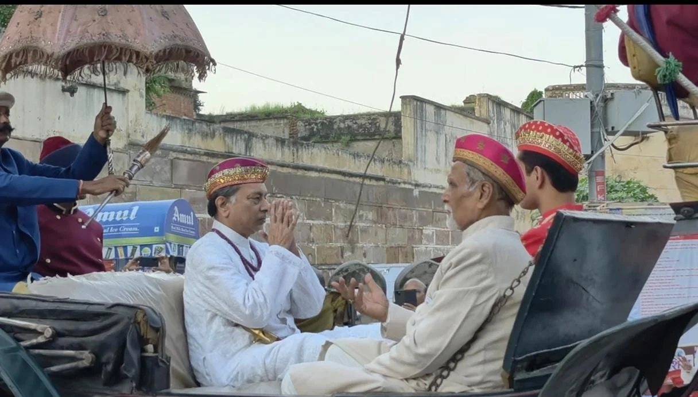

**वाराणसी।** रामनगर की विश्वप्रसिद्ध रामलीला में रविवार को रामायण के अयोध्या कांड के महत्वपूर्ण प्रसंगों का भावपूर्ण मंचन किया गया। श्रीराम के वन-गमन से जुड़े विभिन्न पड़ावों को कलाकारों ने जीवंत किया। भगवान राम, माता सीता और लक्ष्मण के वन प्रस्थान से लेकर चित्रकूट में पर्णकुटी बनाकर निवास करने और अयोध्या में राजा दशरथ के पुत्र-वियोग में प्राण त्यागने तक के प्रसंगों ने श्रद्धालुओं को भावुक कर दिया।

रामलीला में सबसे पहले श्रृंगवेरपुर में निषादराज गुह से श्रीराम की भेंट और गंगा पार करने का प्रसंग मंचित हुआ। केवट द्वारा भगवान राम, माता सीता और लक्ष्मण को नाव से गंगा पार कराने का दृश्य श्रद्धालुओं के बीच विशेष आकर्षण का केंद्र रहा।

इसके बाद श्रीराम प्रयागराज पहुंचे, जहां महर्षि भरद्वाज के आश्रम में उनका समागम हुआ। महर्षि ने भगवान राम का आदर-सत्कार किया और उन्हें आगे चित्रकूट में निवास करने की सलाह दी। इसके बाद श्रीराम, सीता और लक्ष्मण ने यमुना नदी का तट पार किया।

वन यात्रा के दौरान मार्ग में आने वाले गांवों के ग्रामीणों ने भी श्रीराम, सीता और लक्ष्मण के दर्शन किए। भगवान राम के त्याग, माता सीता की सरलता और लक्ष्मण की सेवा भावना को देखकर ग्रामीण भावविभोर नजर आए।

चित्रकूट पहुंचने पर महर्षि वाल्मीकि से श्रीराम का समागम हुआ। भगवान राम ने उनसे निवास के लिए स्थान पूछा। महर्षि वाल्मीकि ने श्रीराम की महिमा का वर्णन करते हुए उन्हें चित्रकूट में निवास करने का मार्ग बताया।

इसके बाद कामदगिरि पर्वत और मंदाकिनी नदी के तट पर श्रीराम, सीता और लक्ष्मण के पर्णकुटी बनाकर रहने का प्रसंग मंचित किया गया। वन का वातावरण, पर्णकुटी और तीनों पात्रों का सादगीपूर्ण जीवन देखकर रामलीला देखने पहुंचे श्रद्धालु भावुक हो उठे।

इधर अयोध्या में श्रीराम के वन में रुकने का समाचार लेकर मंत्री सुमन्त का अकेले लौटना दिखाया गया। सुमन्त के अयोध्या पहुंचने और राजा दशरथ को श्रीराम के वापस न आने की जानकारी देने का दृश्य बेहद मार्मिक रहा।

पुत्र-वियोग की पीड़ा में डूबे राजा दशरथ ने अंततः प्राण त्याग दिए। दशरथ के निधन का प्रसंग मंचित होते ही रामलीला स्थल पर मौजूद श्रद्धालुओं की आंखें नम हो गईं। पूरे आयोजन में श्रीराम के त्याग, पिता के वचन की मर्यादा और अयोध्या के राजपरिवार के वियोग को प्रभावशाली ढंग से प्रस्तुत किया गया।

**संवाददाता - पवन जायसवाल**
