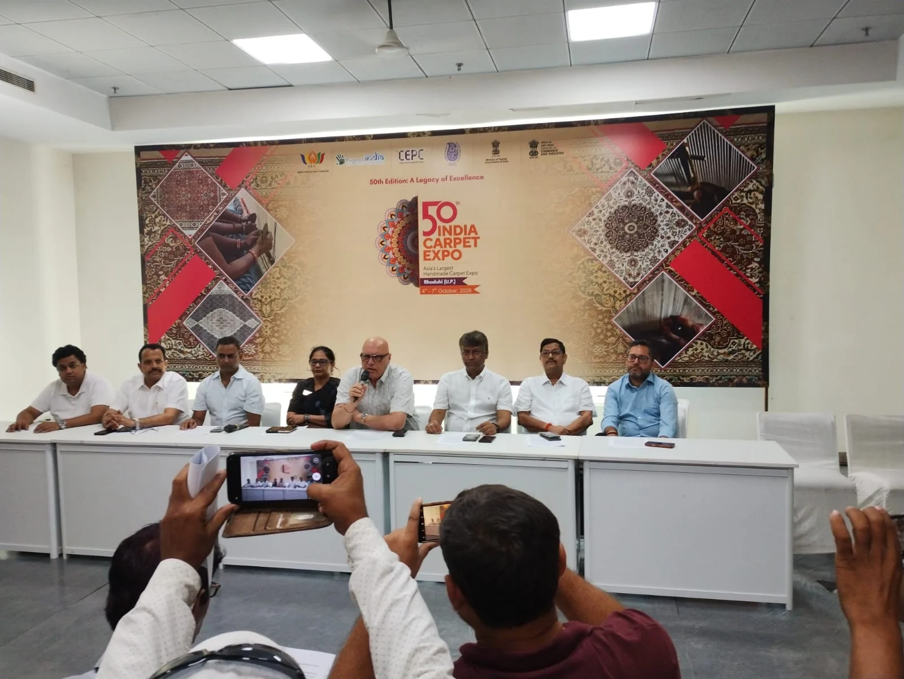

**भदोही।** कालीनों की महीन बुनावट और कारीगरों की उंगलियों में बसे हुनर की पहचान भदोही एक बार फिर दुनिया के सामने अपनी विरासत पेश करने जा रहा है। भदोही के कारपेट एक्सपो मार्ट में 4 से 7 अक्टूबर तक 50वें इंडिया कार्पेट एक्सपो के गोल्डन जुबली संस्करण का आयोजन किया जा रहा है।

कारपेट एक्सपोर्ट प्रमोशन काउंसिल यानी CEPC की ओर से आयोजित इस एक्सपो में भारत के हस्तनिर्मित कालीन, रग्स और फ्लोर कवरिंग्स की शानदार रेंज देखने को मिलेगी।

इस बार एक्सपो में 223 से अधिक प्रदर्शक हिस्सा ले रहे हैं, जबकि 65 देशों के 430 विदेशी खरीदार भी पंजीकरण करा चुके हैं। इनमें BRICS देशों के 106 खरीदार शामिल हैं।

भदोही में पांचवीं बार आयोजित हो रहा यह एक्सपो सिर्फ कारोबार का मंच नहीं, बल्कि भारत की सदियों पुरानी बुनाई परंपरा और आधुनिक वैश्विक बाजार के बीच एक महत्वपूर्ण सेतु के रूप में देखा जा रहा है।

विदेशी खरीदारों की बड़ी भागीदारी से भदोही के कालीन उद्योग को नए बाजार, नए कारोबारी संबंध और अंतरराष्ट्रीय स्तर पर अपनी पहचान मजबूत करने के अवसर मिलने की उम्मीद है।

CEPC अध्यक्ष कैप्टन मुकेश कुमार गोम्बर के मुताबिक, बदलते वैश्विक व्यापारिक माहौल और टैरिफ से जुड़ी चुनौतियों के बीच परिषद सरकार के साथ लगातार संवाद कर रही है। वहीं CEPC के उपाध्यक्ष असलम महबूब ने गोल्डन जुबली संस्करण को भारतीय हस्तनिर्मित कालीन विरासत का उत्सव बताया।

एक्सपो के दौरान BRICS Carpet & Craft Conclave 2026 और छह ज्ञान सत्र भी आयोजित किए जाएंगे। इसके अलावा ‘Navshristi 2026’ के माध्यम से भारतीय हस्तनिर्मित कालीनों में उत्कृष्टता, नवाचार और पारंपरिक शिल्पकला को दुनिया के सामने प्रदर्शित किया जाएगा।

कभी घरों की सजावट तक सीमित समझे जाने वाले भदोही के कालीन आज भारतीय कारीगरों की वैश्विक पहचान बन चुके हैं। ऐसे में 50वें इंडिया कार्पेट एक्सपो का गोल्डन जुबली संस्करण भदोही के कालीन उद्योग के लिए कारोबार के साथ-साथ अपनी समृद्ध विरासत को दुनिया के सामने पेश करने का बड़ा अवसर साबित हो सकता है।

**रिपोर्ट - राजेश जायसवाल**
