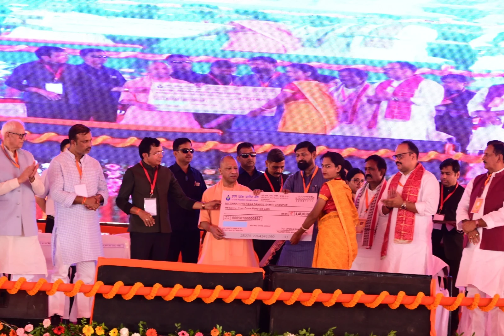
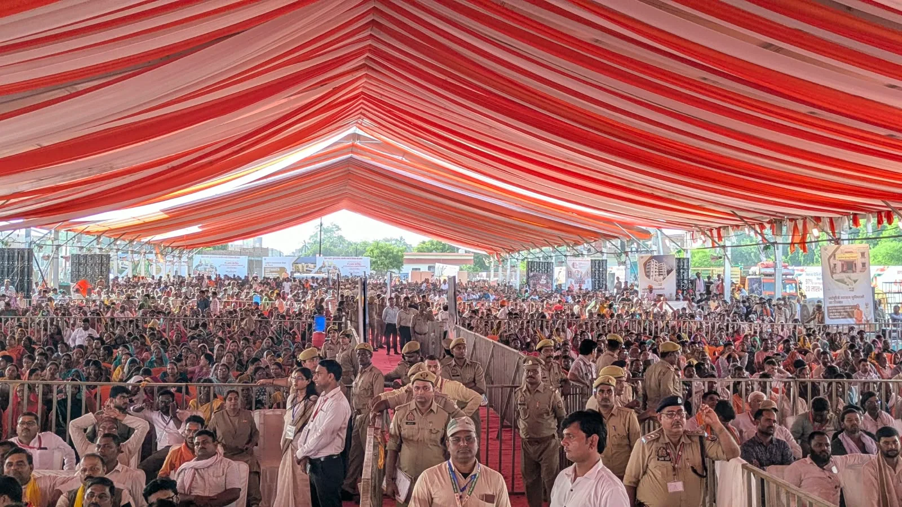

**भदोही।** कालीन नगरी भदोही के विकास को रविवार को बड़ी गति मिली। मुख्यमंत्री योगी आदित्यनाथ ने भिखारीपुर-अभयनपुर में आयोजित जनसभा के दौरान 1340.11 करोड़ रुपये की 112 विकास परियोजनाओं का लोकार्पण और शिलान्यास किया। इनमें 440.84 करोड़ की 65 परियोजनाओं का लोकार्पण तथा 899.27 करोड़ की 47 परियोजनाओं का शिलान्यास शामिल है।

मुख्यमंत्री ने ज्ञानपुर क्षेत्र में गंगा नदी पर 320.51 करोड़ रुपये की लागत से बनने वाले दीर्घ सेतु और मुंशीलाटपुर में 209.18 करोड़ रुपये की लागत से 574 बंदियों की क्षमता वाली नई जिला जेल का शिलान्यास किया। गंगा सेतु के निर्माण से आवागमन बेहतर होने की उम्मीद है, जबकि नई जिला जेल आधुनिक सुविधाओं से लैस होगी।

मुख्यमंत्री ने कहा कि भदोही अब केवल कालीन उद्योग के लिए ही नहीं, बल्कि विकास, सुशासन, सुरक्षा, निवेश और रोजगार के नए केंद्र के रूप में भी आगे बढ़ रहा है। उन्होंने बताया कि काशी नरेश विश्वविद्यालय की स्थापना के बाद जिले के कॉलेजों को विश्वविद्यालय से जोड़ने की प्रक्रिया पूरी हो चुकी है।

**बिजली, सड़क और स्वास्थ्य क्षेत्र को भी मजबूती**

लोकार्पित परियोजनाओं में भदोही जीआईएस विद्युत उपकेंद्र, जिला अस्पतालों के स्वतंत्र विद्युत फीडर, सड़क चौड़ीकरण व सुदृढ़ीकरण, पुलिस बैरक, ड्रग वेयर हाउस, पशु चिकित्सालय और ठोस अपशिष्ट प्रबंधन जैसी योजनाएं शामिल हैं। वहीं विंध्य एक्सप्रेस-वे, गंगा सेतु, पेयजल योजना, पुलिस ट्रांजिट हॉस्टल, सरकारी आवास और जिला मुख्यालय पर ऑडिटोरियम जैसी परियोजनाओं पर भी काम आगे बढ़ेगा।

कार्यक्रम के दौरान मुख्यमंत्री ने विभिन्न विभागों की प्रदर्शनी का अवलोकन किया और लाभार्थियों को डेमो चेक, आवास की चाबी, नियुक्ति पत्र और आयुष्मान कार्ड वितरित किए। कार्यक्रम में जिलाधिकारी शैलेष कुमार, पुलिस अधीक्षक अभिनव त्यागी समेत प्रशासनिक अधिकारी मौजूद रहे।
