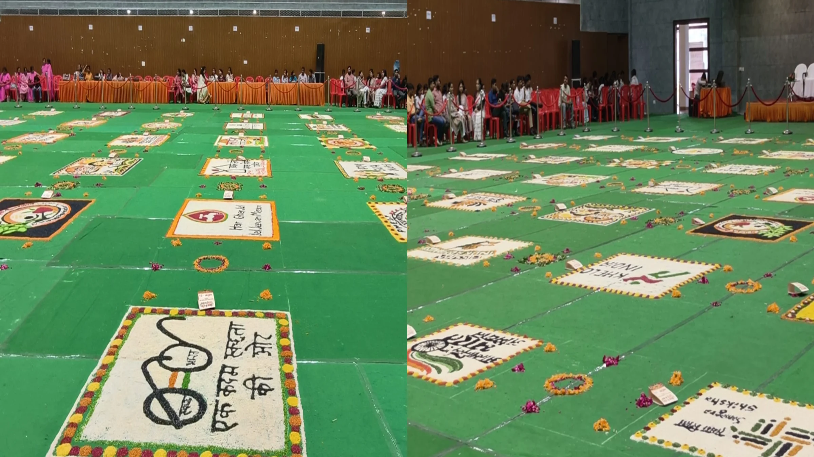

**वाराणसी।** शहर के सिगरा स्टेडियम में आयोजित जनपद स्तरीय रंगोली निर्माण प्रतियोगिता में रंगों के माध्यम से देशभक्ति, सेवा और विकसित भारत की अनूठी झलक देखने को मिल रही है। प्रतियोगिता में वाराणसी समेत विभिन्न क्षेत्रों से आए कलाकार अपनी रचनात्मकता और कलात्मक प्रतिभा का प्रदर्शन कर रहे हैं।

**'सेवा के रंग, राष्ट्र के संग' थीम पर कलाकारों ने उकेरी सपनों के भारत की तस्वीर**

प्रतियोगिता की थीम “सेवा के रंग, राष्ट्र के संग—मेरे सपनों का भारत” निर्धारित की गई है। इसी विषय पर प्रतिभागी कलाकार आकर्षक रंगोलियों के माध्यम से राष्ट्रप्रेम, सामाजिक सरोकार, सेवा भावना और विकसित भारत की परिकल्पना को जीवंत रूप दे रहे हैं।

**रंगोलियों ने मोहा दर्शकों का मन**

सिगरा स्टेडियम में एक साथ सजी रंग-बिरंगी रंगोलियां लोगों के आकर्षण का केंद्र बनी हुई हैं। कार्यक्रम को देखने और कलाकारों का उत्साह बढ़ाने के लिए बड़ी संख्या में लोग स्टेडियम पहुंच रहे हैं। कलाकारों की कल्पनाशीलता और रंगों का अनूठा संयोजन दर्शकों को आकर्षित कर रहा है।

**कला के माध्यम से राष्ट्रभक्ति और सेवा का संदेश**

आयोजकों के अनुसार, प्रतियोगिता का मुख्य उद्देश्य रंगोली कला को प्रोत्साहित करने के साथ-साथ समाज में सेवा, राष्ट्रभक्ति और विकसित भारत की भावना को बढ़ावा देना है। कलाकार अपनी रंगोलियों के जरिए भारत के उज्ज्वल भविष्य की तस्वीर प्रस्तुत कर रहे हैं।

**संवाददाता - पवन जायसवाल**
