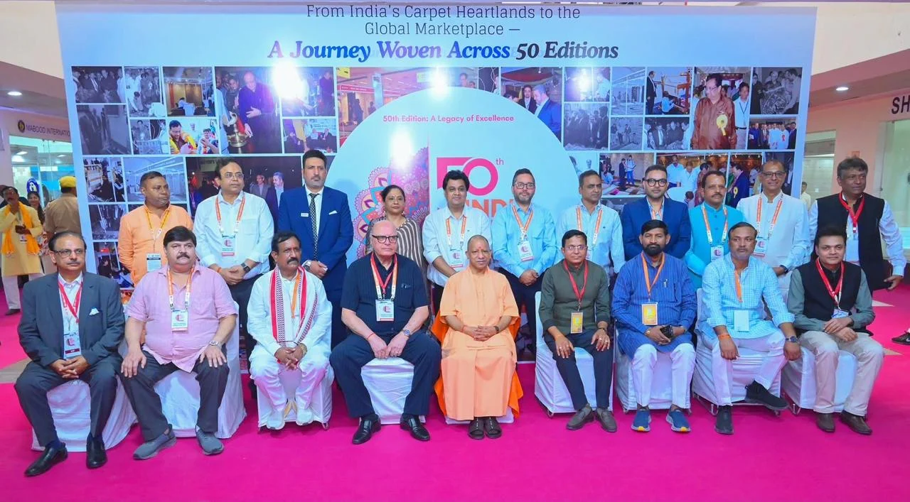
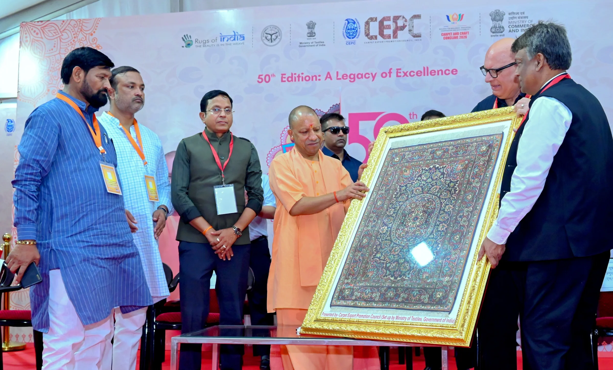

**भदोही।** कालीन नगरी भदोही ने रविवार को अपने गौरवशाली हस्तशिल्प इतिहास में एक और सुनहरा अध्याय जोड़ दिया। कारपेट एक्सपो मार्ट में आयोजित 50वें गोल्डन जुबली इंडिया कारपेट एक्सपो का मुख्यमंत्री योगी आदित्यनाथ ने विधिवत शुभारंभ किया। 4 से 7 अक्टूबर तक आयोजित होने वाला यह एक्सपो भदोही के कालीन उद्योग को वैश्विक बाजार से जोड़ने की दिशा में महत्वपूर्ण मंच माना जा रहा है।

मुख्यमंत्री के आगमन पर भिखारीपुर मैदान स्थित हेलीपैड पर जनप्रतिनिधियों, भाजपा कार्यकर्ताओं और अधिकारियों ने उनका स्वागत किया। इसके बाद मुख्यमंत्री कारपेट एक्सपो मार्ट पहुंचे और अंतरराष्ट्रीय स्तर पर प्रदर्शित कालीन उत्पादों का अवलोकन किया।

**निर्यातकों और उद्यमियों से किया संवाद**

मुख्यमंत्री योगी आदित्यनाथ ने कालीन उद्योग से जुड़े निर्यातकों, विक्रेताओं और उद्यमियों से संवाद कर उद्योग की मौजूदा स्थिति, चुनौतियों और वैश्विक बाजार की संभावनाओं की जानकारी ली। उन्होंने कहा कि प्रदेश सरकार हुनर को इंफ्रास्ट्रक्चर, कालीन को कौशल, उद्यमियों को बाजार और स्थानीय उत्पादों को वैश्विक मांग से जोड़ने की दिशा में काम कर रही है।

मुख्यमंत्री ने बताया कि संत रविदास नगर और शिल्प क्लस्टर से करीब 600 करोड़ रुपये का निर्यात हो रहा है। इससे स्थानीय कारीगरों, हस्तशिल्पियों और कालीन उद्योग से जुड़े लोगों को लाभ मिल रहा है।

**ODOP से कालीन उद्योग को मिला नया बाजार**

योगी आदित्यनाथ ने कहा कि एक जिला, एक उत्पाद (ODOP) योजना से जुड़ने के बाद भदोही के कालीन उद्योग को नए बाजार मिले हैं। डिजाइन और तकनीक के क्षेत्र में सरकारी सहयोग से कारीगरों और हस्तशिल्पियों के लिए रोजगार एवं कारोबार के नए अवसर तैयार हुए हैं।

**पीएम मित्र टेक्सटाइल पार्क पर भी चर्चा**

मुख्यमंत्री ने बताया कि लखनऊ और हरदोई के बीच करीब एक हजार एकड़ क्षेत्रफल में पीएम मित्र टेक्सटाइल पार्क विकसित करने की दिशा में तेजी से काम चल रहा है। यहां तकनीकी शिक्षा के साथ डिजाइनिंग और डिजाइन प्रशिक्षण की सुविधाएं भी विकसित की जाएंगी।

उन्होंने कहा कि प्रदेश के प्रत्येक जनपद में लौह पुरुष सरदार वल्लभभाई पटेल एम्प्लॉयमेंट एंड इंडस्ट्रियल जोन के गठन की दिशा में भी कदम बढ़ाए जा रहे हैं, जिससे उद्योगों को जरूरत के अनुसार प्रशिक्षित और कुशल मानव संसाधन उपलब्ध हो सके।

**भदोही की विरासत को वैश्विक पहचान दिलाने पर जोर**

मुख्यमंत्री ने संत रविदास नगर को कला, कौशल और विरासत की समृद्ध भूमि बताते हुए कहा कि बाबा विश्वनाथ धाम की नगरी काशी और संगम नगरी प्रयागराज के बीच स्थित यह क्षेत्र अपनी हस्तशिल्प परंपरा के लिए विशिष्ट पहचान रखता है।

50वां गोल्डन जुबली इंडिया कारपेट एक्सपो भदोही के कालीन उद्योग को वैश्विक बाजार में नई पहचान दिलाने का महत्वपूर्ण अवसर बनकर सामने आया है। एक्सपो के शुभारंभ के साथ ही निर्यातकों और कालीन कारोबारियों को अंतरराष्ट्रीय बाजार में नए अवसर मिलने की उम्मीद बढ़ी है।

कार्यक्रम के दौरान जिलाधिकारी शैलेष कुमार, पुलिस अधीक्षक अभिनव त्यागी, अपर जिलाधिकारी शुभांगी शुक्ला, अपर पुलिस अधीक्षक शुभम अग्रवाल समेत संबंधित विभागों के अधिकारी मौजूद रहे। मुख्यमंत्री के कार्यक्रम को देखते हुए हेलीपैड से लेकर एक्सपो स्थल तक सुरक्षा के व्यापक इंतजाम किए गए थे।

**चीफ - को आर्डिनेटर- राजेश जायसवाल की रिपोर्ट**
