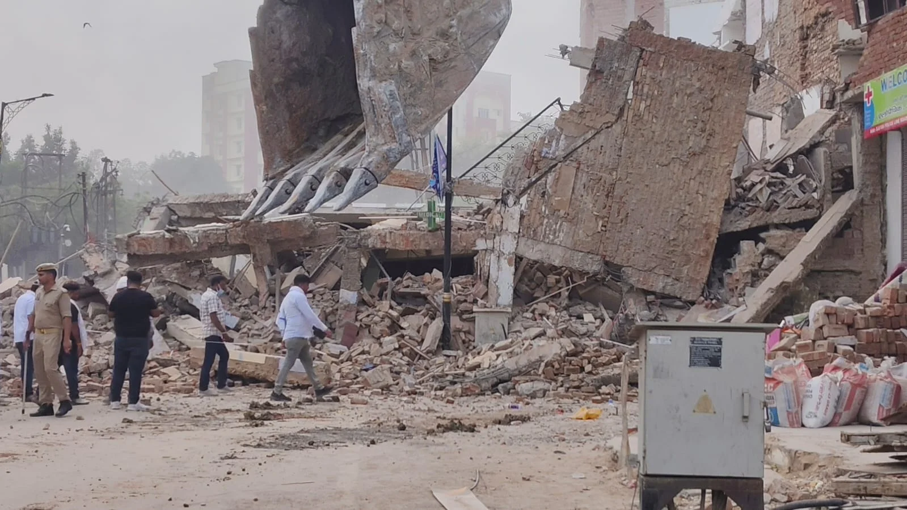

**वाराणसी।** कैंट थाना क्षेत्र के कचहरी चौराहे पर मंगलवार को नगर निगम की ओर से सड़क चौड़ीकरण को लेकर बड़ा ध्वस्तीकरण अभियान शुरू किया गया। कार्रवाई के लिए मौके पर छह बुलडोजर लगाए गए हैं और करीब 10 मकानों को ध्वस्त किया जा रहा है।

नगर निगम अधिकारियों के मुताबिक, संबंधित भवनों को जर्जर घोषित कर भवन मालिकों को पहले ही नोटिस और अंतिम चेतावनी दी गई थी। अधिकारियों का कहना है कि निर्धारित समय के बावजूद निर्माण नहीं हटाए जाने पर नियमानुसार यह कार्रवाई की जा रही है। यह अभियान कचहरी से संदहा तक सड़क चौड़ीकरण योजना के तहत बताया जा रहा है।

कार्रवाई के दौरान तीन मंजिला मकानों को भी बुलडोजर से गिराया जा रहा है। सुरक्षा व्यवस्था के मद्देनजर मौके पर भारी पुलिस फोर्स तैनात की गई है।

**मुआवजे को लेकर मकान मालिकों में नाराजगी**

ध्वस्तीकरण की कार्रवाई को लेकर प्रभावित मकान मालिकों और स्थानीय लोगों में नाराजगी है। उनका आरोप है कि उन्हें अभी तक मुआवजा नहीं मिला, इसके बावजूद मकानों पर बुलडोजर चलाया जा रहा है। प्रभावित लोगों का कहना है कि मकान टूटने के बाद उनके सामने रहने की समस्या खड़ी हो जाएगी।

वहीं, नगर निगम अधिकारियों का कहना है कि कार्रवाई से पहले संबंधित भवन मालिकों को नोटिस और अंतिम चेतावनी दी जा चुकी थी। इसके बाद नियमों के तहत ध्वस्तीकरण की कार्रवाई की जा रही है।

**संवाददाता – पवन जायसवाल**
