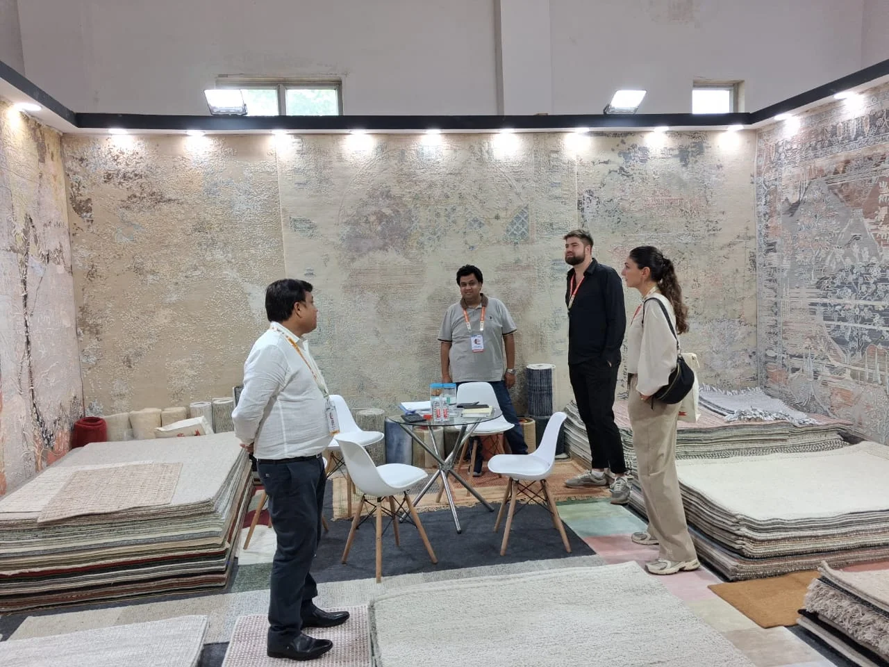

**भदोही।** गोल्डन जुबली 50वें इंडिया कार्पेट एक्सपो के दूसरे दिन भी देश-विदेश के खरीदारों की अच्छी भागीदारी देखने को मिली। कारपेट एक्सपोर्ट प्रमोशन काउंसिल (CEPC) द्वारा आयोजित इस अंतरराष्ट्रीय मेले में पहले दो दिनों में 35 से अधिक देशों के 189 विदेशी खरीदार पहुंचे। इसके अलावा 211 बाइंग रिप्रेजेंटेटिव्स ने भी एक्सपो का दौरा किया।

अमेरिका, ब्रिटेन, जर्मनी, फ्रांस, इटली, जापान, ऑस्ट्रेलिया, कनाडा, रूस, यूएई, सऊदी अरब, ब्राजील, बेल्जियम, नीदरलैंड, तुर्की और स्पेन समेत कई देशों के खरीदारों ने भारतीय हस्तनिर्मित कालीन, रग्स और फ्लोर-कवरिंग उत्पादों में रुचि दिखाई। एक्सपो में खरीदारों की मांग के अनुरूप नए डिजाइन, रंग, आकार और गुणवत्ता वाले कलेक्शन प्रदर्शित किए जा रहे हैं।

मेले के दौरान न्यूजीलैंड की ऊन और Amazon Global Seller Programme को लेकर ज्ञानवर्धक सत्र भी आयोजित किए गए। वहीं जिलाधिकारी शैलेश कुमार ने परिवार के साथ एक्सपो का भ्रमण कर विभिन्न स्टॉलों पर प्रदर्शित उत्पादों की सराहना की।

225 से अधिक प्रदर्शकों की भागीदारी वाला यह एक्सपो भारतीय हस्तनिर्मित कालीन उद्योग के लिए बड़ा कारोबारी मंच बनकर उभरा है। विदेशी खरीदारों की बढ़ती संख्या से उद्योग को नए अंतरराष्ट्रीय बाजार और व्यापारिक अवसर मिलने की उम्मीद है।

**रिपोर्ट - राजेश जायसवाल**
