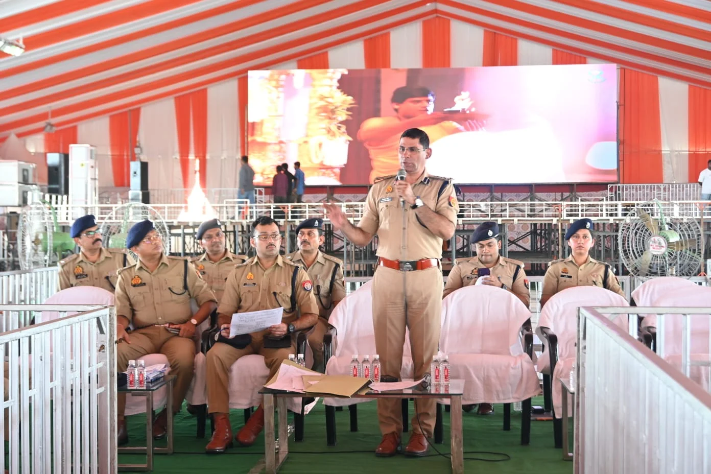
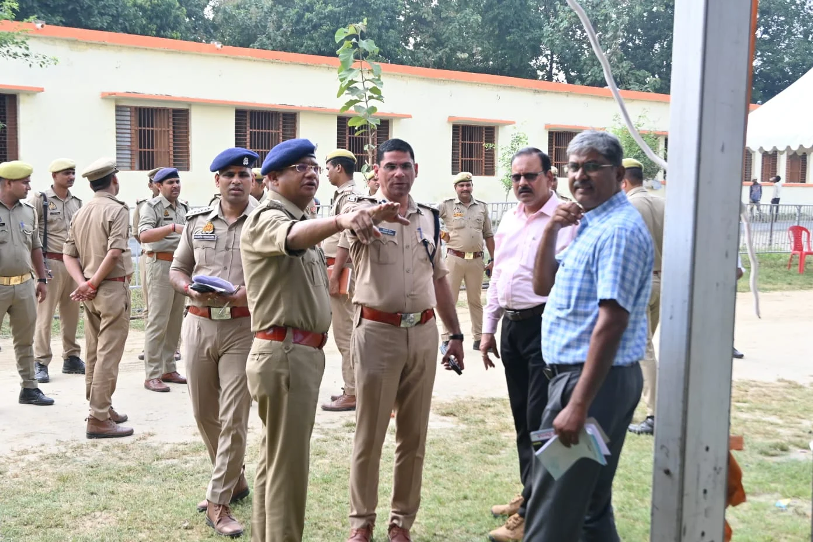

**वाराणसी।** मुख्यमंत्री योगी आदित्यनाथ, असम के मुख्यमंत्री और भाजपा के राष्ट्रीय अध्यक्ष के 7 अक्टूबर को वाराणसी आगमन को लेकर कमिश्नरेट पुलिस ने सुरक्षा और यातायात व्यवस्था को लेकर विस्तृत ट्रैफिक एडवाइजरी जारी की है। VVIP मूवमेंट के दौरान शहर के कई प्रमुख मार्गों पर वाहनों की आवाजाही रोकी या डायवर्ट की जाएगी। यह व्यवस्था कार्यक्रम समाप्त होने तक आवश्यकता के अनुसार लागू रहेगी।

सुबह 11 बजे से बाबतपुर की ओर से आने वाली रोडवेज और निजी बसों को हरहुआ ओवरब्रिज के ऊपर जाने की अनुमति नहीं होगी। इन्हें हरहुआ रिंग रोड चौराहा से परमपुर की ओर भेजा जाएगा। 

जौनपुर, गाजीपुर और आजमगढ़ की ओर से आने वाली बसों को हरहुआ रिंग रोड अंडरपास तक आने दिया जाएगा, जहां से उन्हें परमपुर-लोहता होते हुए चांदपुर की ओर डायवर्ट किया जाएगा।

मोहनसराय अंडरपास से आने वाले चार पहिया और बड़े वाहनों को जगतपुर डिग्री कॉलेज की ओर जाने से रोका जाएगा। इन्हें अखरी और स्खौना की ओर भेजा जाएगा। अमरा-अखरी अंडरपास से आने वाली बसों को भी शहर में प्रवेश नहीं दिया जाएगा और डाफी की ओर डायवर्ट किया जाएगा।

**ऑटो और ई-रिक्शा पर भी प्रतिबंध**

VVIP मूवमेंट के दौरान पुलिस लाइन से चौकाघाट, तेलियाबाग, मलदहिया और सिगरा के बीच ऑटो व ई-रिक्शा का संचालन प्रतिबंधित किया जा सकता है। भिखारीपुर से लहरतारा और चांदपुर तक भी आवश्यकतानुसार प्रतिबंध लागू रहेगा।

शाम 4 बजे से लकड़ीमंडी, चौकाघाट, लहुराबीर, मैदागिन और विशेश्वरगंज मार्ग पर ऑटो व ई-रिक्शा के संचालन पर रोक रहेगी। VVIP के आगमन और प्रस्थान के समय मैदागिन से गोदौलिया के बीच सभी वाहनों की आवाजाही पूरी तरह प्रतिबंधित रहेगी।

**मालवाहक वाहनों के लिए भी एडवाइजरी**

राजघाट पुल और सूजाबाद की ओर से शाम 4 बजे से मालवाहक वाहनों का संचालन बंद रहेगा। विशेश्वरगंज तिराहा से मैदागिन की ओर जाने वाले चार पहिया वाहनों को गोलगड्डा की ओर डायवर्ट किया जाएगा।

सिगरा, रथयात्रा, साजन तिराहा, आकाशवाणी, महमूरगंज, मंडुवाडीह और ककरमत्ता क्षेत्र में भी VVIP मूवमेंट के दौरान यातायात डायवर्जन लागू रहेगा।

**यातायात पुलिस की अपील**

यातायात पुलिस ने लोगों से अपील की है कि 7 अक्टूबर को घर से निकलने से पहले ट्रैफिक डायवर्जन का ध्यान रखें, कार्यक्रम वाले मार्गों से बचें और जरूरत पड़ने पर वैकल्पिक रास्तों का इस्तेमाल करें। लोगों से अतिरिक्त समय लेकर घर से निकलने की अपील की गई है।

**ट्रैफिक कंट्रोल रूम: 7839856994**

**ट्रैफिक हेल्पलाइन: 7317202020**

**संवाददाता – पवन जायसवाल**
