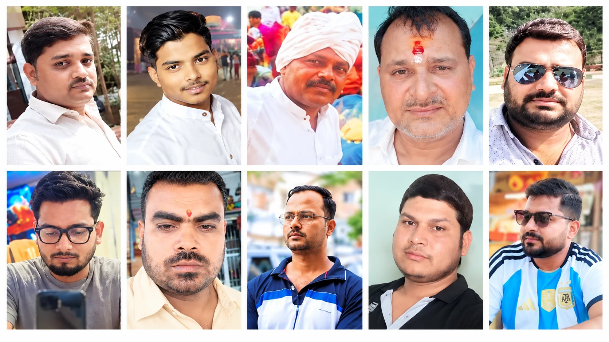

**वाराणसी।** बाबा विश्वनाथ की नगरी काशी अपनी आध्यात्मिक पहचान के लिए पूरी दुनिया में जानी जाती है। लेकिन इसी शहर के अलग-अलग इलाकों से अगर खुलेआम जुए के अड्डे संचालित होने की शिकायतें सामने आएं तो सवाल सिर्फ जुआरियों से नहीं, बल्कि उस पूरे सिस्टम से पूछा जाना चाहिए जिसके जिम्मे कानून-व्यवस्था है।

सवाल यह नहीं है कि पुलिस कार्रवाई करती है या नहीं। सवाल यह है कि कार्रवाई के बाद वही गतिविधियां दोबारा कैसे शुरू हो जाती हैं?

कुबेर कॉम्प्लेक्स में हुई कार्रवाई इसका जीता-जागता उदाहरण  है। वहां छापेमारी के दौरान बड़ी संख्या में लोगों की गिरफ्तारी और लाखों रुपये की बरामदगी की बात सामने आई। कार्रवाई के बाद कुछ दिनों तक सन्नाटा रहा, लेकिन उसके बाद फिर अलग अलग इलाकों में जुए के अड्डे सक्रिय होने लगे। अगर यह सही है तो यह केवल जुआरियों की हिम्मत नहीं, बल्कि पुलिस की निगरानी व्यवस्था पर भी गंभीर सवाल है।

**कार्रवाई हुई तो फिर वही खेल कैसे शुरू हुआ ?**

बताया जा रहा है कि मुकीमगंज-आदमपुर, हुकुलगंज, ढेलवरिया, जैतपुरा, कैंट और रोहनियां क्षेत्र, कोटवां, लोहता थाना सहित कई स्थानों पर जुए के संचालन को लेकर शिकायतें और चर्चाएं हैं। कुछ लोगों के नाम भी इन गतिविधियों से जोड़कर लिए जा रहे हैं। इनमें दीपक यादव (कल्लू), निक्की जायसवाल, गौरव सिंह उर्फ पिंचू, अजय जायसवाल, सुनील सिंह, रामू और शिवम चतुर्वेदी, विजय सोनपापड़ी, रोशन सिंधी समेत कई नाम जुए में संलिप्त है,आखिर ये किसकी कृपा से फल-फूल रहे हैं?

मुकीमगंज -आदमपुर के दीपक यादव (कल्लू) के बारे में पता चला है कि वह पहले पान की दुकान चलाता था लेकिन आजकल जुएं का अवैध कारोबार संचालित कर रहा है और इसी अवैध कारोबार के चलते एक पान की दुकान चलाने वाला व्यक्ति आज करोड़ों की सम्पत्ति का मालिक बनकर बैठा है आखिर पुलिस ऐसे लोगों पर कार्यवाही क्यों नहीं करती?

लेकिन यहां सबसे जरूरी बात यह है कि इन आरोपों की स्वतंत्र और आधिकारिक पुष्टि होना बाकी है।

यही कारण है कि पुलिस के लिए भी यह मौका है कि वह केवल छोटे स्तर पर जुआ खेलते पकड़े जाने वालों तक सीमित न रहे, बल्कि यह पता लगाए कि इन अड्डों के पीछे वास्तव में कौन लोग हैं? पैसा कहां से आता है? किसका संरक्षण है और कार्रवाई के बाद नेटवर्क फिर कैसे खड़ा हो जाता है।

**क्या जुआ अकेले आदमी का अपराध है? यही सबसे बड़ा सवाल है।**

अगर किसी इलाके में रोजाना लाखों रुपये के दांव लगने की शिकायत है तो क्या यह काम कोई एक व्यक्ति अकेले कर सकता है?निश्चित तौर पर जबाब होता है नहीं। ऐसे नेटवर्क में कथित तौर पर जगह की व्यवस्था, खिलाड़ियों को बुलाना, पैसे का हिसाब, सुरक्षा, सूचना का आदान प्रदान और पुलिस की गतिविधियों पर नजर रखने जैसे कई स्तर हो सकते हैं।

अगर जांच में संगठित नेटवर्क सामने आता है तो फिर मामला केवल सामान्य जुआ अधिनियम तक सीमित रखने के बजाय संगठित अपराध और अवैध संपत्ति के एंगल से भी जांचे जाने की जरूरत है।

**पुलिस की भूमिका पर सवाल क्यों ?**

पुलिस पर सीधे आरोप लगाना आसान है, लेकिन उससे भी जरूरी है एक तथ्यात्मक सवाल पूछना। अगर पुलिस को जानकारी नहीं है तो क्यों नहीं है? अगर जानकारी है तो कार्रवाई क्यों नहीं?

काशी जैसे शहर में पुलिस का अपना मजबूत स्थानीय नेटवर्क है। बीट पुलिसिंग, मुखबिर तंत्र, थाना स्तर की सूचना व्यवस्था और वरिष्ठ अधिकारियों की सबका निगरानी-इन उद्देश्य यही है कि अपराध होने से पहले उसकी सूचना मिले।

फिर अगर किसी इलाके में लगातार बड़े स्तर पर जुआ चलने की शिकायतें सामने आती हैं तो सवाल उठना स्वाभाविक है कि स्थानीय स्तर पर निगरानी तंत्र आखिर किस काम के लिए है?

**क्या छोटे जुआरियों पर कार्रवाई ही पर्याप्त है?**

किसी अड्डे पर दस-पंद्रह लोगों को पकड़ लेना कार्रवाई जरूर है, लेकिन यदि कुछ दिनों बाद वही कारोबार किसी दूसरी जगह शुरू हो जाए तो इसे स्थायी सफलता नहीं कहा जा सकता।

असल सफलता तब होगी जब पुलिस यह पता लगाए कि-
पैसा किसका है? अड्डा किसका है? संचालन कौन करता है? किसके संरक्षण में चलता है? कमाई कहां जाती है? और कार्रवाई की सूचना पहले किसे मिलती है? इन सवालों के जवाब अगर मिल जाएं तो जुए के नेटवर्क की कमर तोड़ी जा सकती है।

**परिवार बर्बाद होते हैं, सिर्फ जुआरी नहीं**

जुए को कई बार लोग मामूली अपराध समझ लेते हैं। लेकिन इसकी सामाजिक कीमत बहुत बड़ी हो सकती है।

जुए में पैसा हारने के बाद कर्ज बढ़ता है। कर्ज बढ़ने पर घरेलू विवाद होते हैं। इसके बाद चोरी, धोखाधड़ी, मारपीट और दूसरे अपराधों की स्थिति पैदा हो सकती है। यानी जुआ सिर्फ एक मेज पर बैठे लोगों का खेल नहीं है। इसके पीछे कई परिवारों की आर्थिक तबाही छिपी हो सकती है। इसीलिए जुए के खिलाफ कार्रवाई को केवल आंकड़ों में दर्ज गिरफ्तारियों से नहीं, बल्कि पूरे नेटवर्क को खत्म करने की क्षमता से मापा जाना चाहिए।

**डीजीपी राजीव कृष्ण से उम्मीद**

उत्तर प्रदेश के डीजीपी राजीव कृष्ण के नेतृत्व में अपराध के खिलाफ कार्रवाई और ऑपरेशन कनविक्शन जैसे अभियानों पर जोर दिया जा रहा है। ऐसे में काशी के कथित जुआ नेटवर्क को भी गंभीरता से देखे जाने की जरूरत है। जरूरत इस बात की है कि बड़े स्तर पर चलने वाले कथित जुआ अड्डों की सिर्फ छापेमारी न हो, बल्कि उनके पीछे मौजूद पूरे आर्थिक नेटवर्क की जांच की जाए। अगर किसी व्यक्ति ने अवैध गतिविधियों से संपत्ति बनाई है तो कानून के तहत उसकी भी जांच होनी चाहिए।

**मोहित अग्रवाल के सामने बड़ी चुनौती**

वाराणसी पुलिस कमिश्नरेट की कमान लंबे समय से पुलिस कमिश्नर मोहित अग्रवाल के हाथों में है। उनसे शहर की कानून-व्यवस्था को लेकर लोगों की बड़ी अपेक्षाएं हैं। मोहित अग्रवाल की पहचान सख्त पुलिसिंग और नए प्रयोगों के लिए बनी है। ऐसे में जुए के कथित नेटवर्क उनके लिए भी एक बड़ी चुनौती है।

सवाल सीधा है- अगर काशी में कहीं बड़े स्तर पर जुआ चल रहा है तो क्या पुलिस कमिश्नरेट की नजर वहां तक पहुंच रही है? यदि पहुंच रही है तो कार्रवाई क्यों नहीं? अगर जानकारी नहीं पहुंच रही तो सूचना तंत्र को मजबूत करने की जरूरत है। पुलिस करे भी तो क्या-क्या करे ?

**यह भी सच है कि पुलिस के सामने चुनौतियां कम नहीं हैं।**

कानून-व्यवस्था, शराब से जुड़े मामले, अवैध निर्माण, यातायात, दुर्घटनाएं, आपातकालीन कॉल और तमाम दूसरी जिम्मेदारियां पुलिस के सामने होती हैं। लेकि लेकिन इसी वजह से अपराध के संगठित नेटवर्क को नजरअंदाज नहीं किया जा सकता। बल्कि जितना बड़ा नेटवर्क हो, उतनी ही ज्यादा जरूरी है कि पुलिस उसकी जड़ तक पहुंचे।

**काशी को सिर्फ कार्रवाई नहीं, परिणाम चाहिए**

काशी की जनता को पुलिस से सिर्फ प्रेस नोट नहीं चाहिए। उसे परिणाम चाहिए। अगर कोई जुआ अड्डा पकड़ा गया है तो वह दोबारा न चले-यह परिणाम है।

अगर कोई नेटवर्क संचालित कर रहा है तो उसके पूरे नेटवर्क तक पुलिस पहुंचे-यह परिणाम है। अगर अवैध कमाई से संपत्ति बनाई गई है तो उसकी वैधानिक जांच हो-यह परिणाम है। और अगर कहीं पुलिस की मिलीभगत या लापरवाही सामने आती है तो उसकी भी निष्पक्ष जांच हो-यही वास्तविक जवाबदेही है।

**सवाल जुआरियों से ज्यादा सिस्टम से है?**

जुआ खेलना या खिलाना कानून के दायरे में आता है और दोष सिद्ध होने पर कार्रवाई होनी ही चाहिए। लेकिन उससे भी बड़ा सवाल यह है कि आखिर एक कार्रवाई के बाद दूसरा अड्डा कैसे खड़ा हो जाता है?

**क्या केवल जगह बदलने से अपराध खत्म हो जाता है?**

क्या कुछ गिरफ्तारियों के बाद नेटवर्क टूट जाता है? या फिर कहीं कोई ऐसी कड़ी है जिसे पुलिस अभी तक पकड़ नहीं पाई है? काशी की जनता इन सवालों के जवाब चाहती है।
