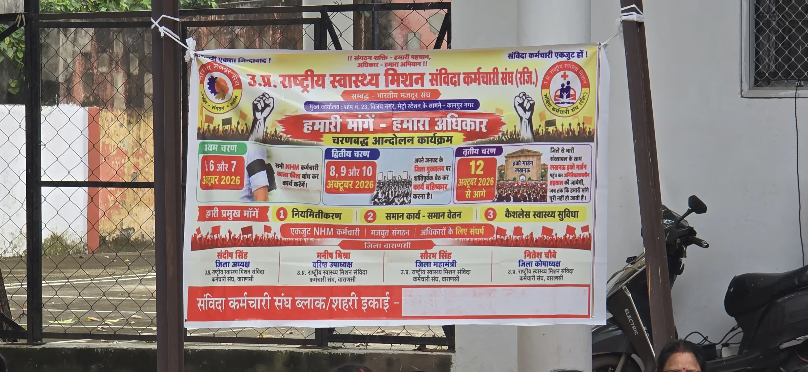
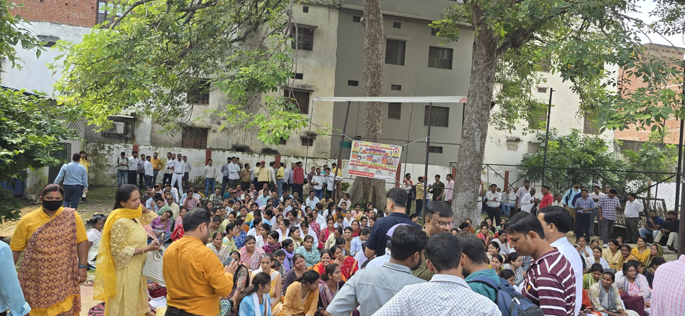

**वाराणसी।** उत्तर प्रदेश राष्ट्रीय स्वास्थ्य मिशन (NHM) के संविदा कर्मचारियों ने अपनी विभिन्न मांगों को लेकर चरणबद्ध आंदोलन का ऐलान किया है। वाराणसी में लगाए गए संगठन के पोस्टर में नियमितीकरण, समान कार्य-समान वेतन और कैशलेस स्वास्थ्य सुविधा को प्रमुख मांगों में शामिल किया गया है।

पोस्टर के अनुसार उ.प्र. राष्ट्रीय स्वास्थ्य मिशन संविदा कर्मचारी संघ की ओर से आंदोलन को तीन चरणों में आयोजित करने की बात कही गई है। पहले चरण में 6 और 7 अक्टूबर 2026 को सभी NHM कर्मचारियों द्वारा काली पट्टी बांधकर कार्य करने का आह्वान किया गया था।

इसके बाद दूसरे चरण में 8, 9 और 10 अक्टूबर को अपने-अपने जनपद के जिला मुख्यालय पर सांकेतिक धरना-प्रदर्शन और कार्य बहिष्कार की बात कही गई है। वहीं तीसरे चरण में 12 अक्टूबर से आगरा में आंदोलन शुरू करने का ऐलान पोस्टर के जरिए किया गया है।

संगठन का कहना है कि संविदा कर्मचारियों की मांगों को लेकर लंबे समय से संघर्ष जारी है। कर्मचारियों ने सरकार से नियमितीकरण, समान कार्य के लिए समान वेतन तथा कैशलेस स्वास्थ्य सुविधा जैसी मांगों पर गंभीरता से विचार करने की अपील की है।

अब देखना होगा कि संविदा कर्मचारियों के इस चरणबद्ध आंदोलन का शासन-प्रशासन पर क्या असर पड़ता है और सरकार की ओर से उनकी मांगों को लेकर क्या कदम उठाए जाते हैं।

**रिपोर्ट - ए जावेद**
