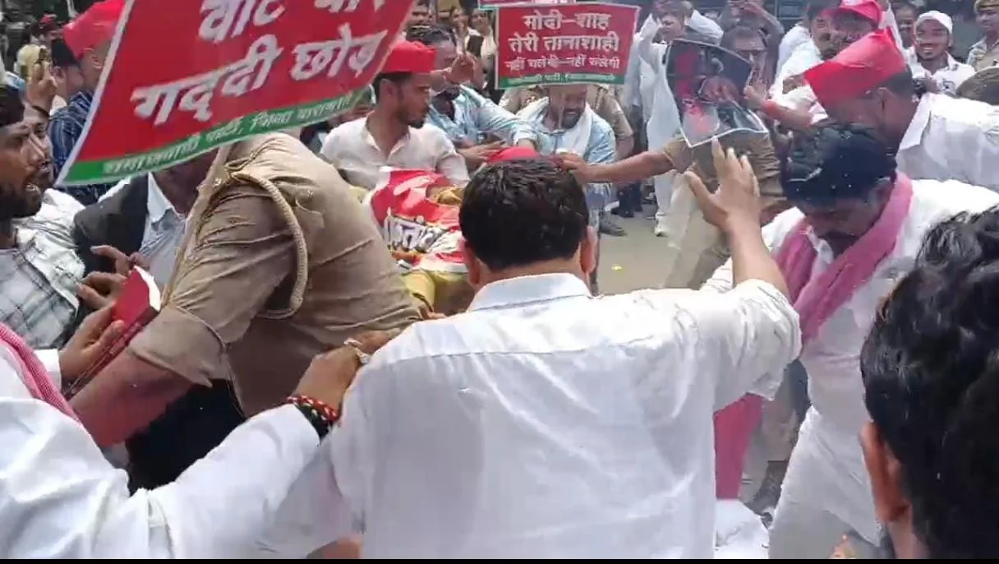

**वाराणसी।** चुनाव आयोग और मुख्य चुनाव आयुक्त ज्ञानेश कुमार के खिलाफ समाजवादी पार्टी ने गुरुवार को वाराणसी में जोरदार विरोध प्रदर्शन किया। कचहरी मुख्यालय पर सपा प्रदेश सचिव लालू यादव के नेतृत्व में पार्टी कार्यकर्ताओं ने जमकर नारेबाजी की और चुनाव आयोग की कार्यप्रणाली पर सवाल उठाए।

प्रदर्शन के दौरान सपा कार्यकर्ताओं ने मुख्य चुनाव आयुक्त ज्ञानेश कुमार का पोस्टर जलाकर अपना विरोध दर्ज कराया। कार्यकर्ताओं ने लोकतंत्र, मताधिकार और निष्पक्ष चुनाव की मांग को लेकर आवाज बुलंद की।

**चुनाव आयोग पर लगाया ‘वोट चोरी’ का आरोप**

 सपा ने चुनाव आयोग और मुख्य चुनाव आयुक्त ज्ञानेश कुमार पर गंभीर आरोप लगाए। उन्होंने दावा किया कि चुनाव आयोग ने प्रधानमंत्री और गृहमंत्री के साथ मिलकर ‘वोट चोरी’ का काम किया है। उन्होंने मुख्य चुनाव आयुक्त पर देश की जनता के साथ विश्वासघात करने का आरोप भी लगाया।

**अखिलेश यादव और वीरेंद्र सिंह के आह्वान पर प्रदर्शन**

सपा प्रदेश सचिव ने बताया कि पार्टी के राष्ट्रीय अध्यक्ष अखिलेश यादव और चंदौली सांसद वीरेंद्र सिंह के आह्वान पर प्रदेशभर में विरोध प्रदर्शन किया जा रहा है। इसी क्रम में वाराणसी में भी पार्टी कार्यकर्ताओं ने कचहरी मुख्यालय पर प्रदर्शन कर चुनाव आयोग के खिलाफ अपना विरोध दर्ज कराया।

**‘इस्तीफा और कार्रवाई तक जारी रहेगा आंदोलन’**

 प्रदर्शन के दौरान कार्यकर्ताओं ने कहा जब तक मुख्य चुनाव आयुक्त ज्ञानेश कुमार इस्तीफा नहीं देते और उनके खिलाफ कार्रवाई नहीं होती, तब तक समाजवादी पार्टी का आंदोलन जारी रहेगा। उन्होंने कहा कि पार्टी कार्यकर्ता जनता के अधिकारों की लड़ाई को मजबूती से आगे बढ़ाएंगे।

प्रदर्शन के दौरान कार्यकर्ताओं ने कहा कि संघर्ष के दौरान उन्हें जेल जाना पड़े या पुलिस की कार्रवाई का सामना करना पड़े, वे पीछे नहीं हटेंगे। सपा नेताओं और कार्यकर्ताओं ने लोकतंत्र, मताधिकार और निष्पक्ष चुनाव के मुद्दे पर अपना आंदोलन आगे भी जारी रखने का संकल्प जताया प्रदर्शन के दौरान कार्यकर्ताओं ने जमकर नारेबाजी की और चुनाव आयोग के खिलाफ अपना आक्रोश जाहिर किया।

**संवाददाता - पवन जायसवाल**
