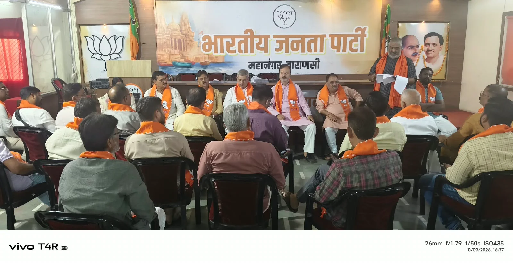

**वाराणसी।** स्नातक निर्वाचन में जीत सुनिश्चित करने के उद्देश्य से भारतीय जनता पार्टी महानगर ने अपनी चुनावी तैयारियां तेज कर दी हैं। शुक्रवार, 9 अक्टूबर को गुलाबबाग स्थित भाजपा महानगर कार्यालय में आयोजित समीक्षा बैठक में मतदाता सूची के सत्यापन, बूथ स्तर पर जनसंपर्क और मतदान प्रक्रिया की बारीकियों पर विस्तार से चर्चा की गई।

बैठक में कार्यकर्ताओं को प्रत्येक स्नातक मतदाता तक पहुंचने, मतदाता सूची में त्रुटियों को दूर कराने और मतदान के दौरान होने वाली गलतियों से बचने के निर्देश दिए गए। आगामी 23 अक्टूबर को प्रस्तावित मतदान को लेकर भी चर्चा हुई। बैठक में बताया गया कि मतदान सुबह 8 बजे से शाम 4 बजे तक निर्धारित है।

चुनाव संचालन प्रमुख एवं पूर्व प्रदेश मंत्री संजय राय ने मतपत्र पर वरीयता अंकित करने के नियमों की जानकारी दी। उन्होंने मतदाताओं को निर्धारित प्रक्रिया के अनुसार वरीयता दर्ज करने और मतदान केंद्र पर उपलब्ध अधिकृत पेन का ही इस्तेमाल करने के प्रति जागरूक करने पर जोर दिया।

वहीं, पूर्व क्षेत्रीय उपाध्यक्ष एवं चुनाव संचालन समिति के सह-प्रमुख सुधीर मिश्रा ने संगठनात्मक सक्रियता बढ़ाने के लिए पदाधिकारियों को नियमित रूप से कार्यालय में समय देने का निर्देश दिया। प्रत्येक विधानसभा क्षेत्र में समन्वय केंद्र संचालित कर चुनाव संबंधी गतिविधियों की निगरानी करने की योजना भी बनाई गई।

पूर्व महापौर एवं मतदाता संपर्क प्रमुख राम गोपाल मोहले ने बूथ अध्यक्षों को मतदान सुनिश्चित कराने के लिए सक्रिय भूमिका निभाने और पार्षदों को कम से कम 50 मतदाताओं से संपर्क करने का लक्ष्य देने की बात कही।

बैठक में मतदाता सूची में नाम खोजने और विवरण का सत्यापन करने के लिए मोबाइल ऐप के उपयोग पर भी जोर दिया गया। डिजिटल और हस्तलिखित मतदाता सूचियों का मिलान कर नामों की वर्तनी संबंधी त्रुटियों को दूर करने तथा विसंगतियां मिलने पर संबंधित कार्यालय को सूचित करने के निर्देश दिए गए।

कार्यकर्ताओं से मतदाताओं के साथ विनम्रता से संवाद करने और मतदान प्रक्रिया के प्रति जागरूकता बढ़ाने की अपील की गई। साथ ही वरीयता आधारित मतदान में दूसरी, तीसरी और चौथी वरीयता के महत्व को भी समझाया गया।

कार्यक्रम का संचालन महानगर उपाध्यक्ष राहुल सिंह ने किया, जबकि धन्यवाद ज्ञापन महानगर महामंत्री अशोक जाटव ने किया। बैठक में महानगर मीडिया संयोजक प्रमील पाण्डेय सहित पार्टी के कई पदाधिकारी और कार्यकर्ता मौजूद रहे।

**रिपोर्ट - प्रमील पांडेय**
